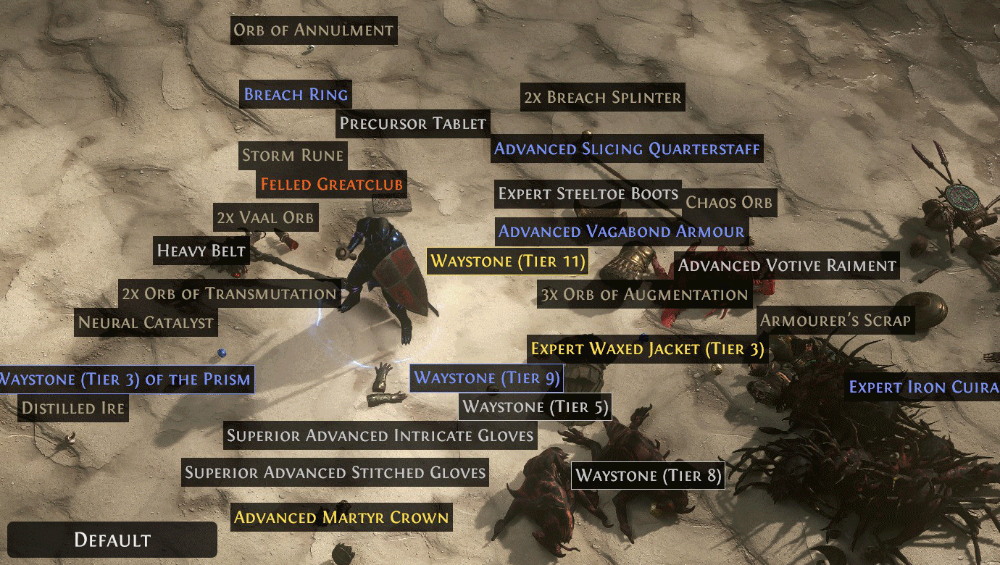
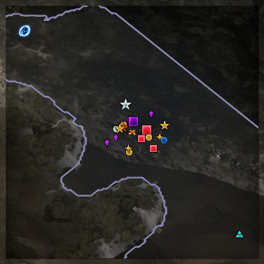
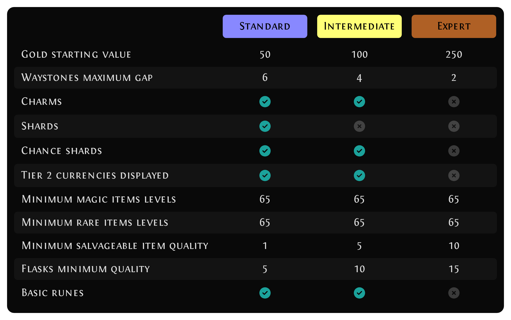

# Shudrum filter

> A filter designed to provide a tailored experience for every stage of the late
> game.

[Jump to the installation guide.](#how-to-install)

[Roadmap](#roadmap) bellow!

# Objective

Long story short, the three main keypoints for those filters are :

- Having a more "verbose" mini map displaying items on ground.
- Having a per area level tailored filter.
- Having a theme driven look'n'feel.





Never miss anything on the ground—find items at a glance with these filters. Some
might say it’s a bit too verbose, but I prefer being able to spot Rares, Waystones,
or other items without running around everywhere.

Since this filter is managed via a script, it allows for dynamic configurations
based on your current map level. For example, you’ll always know if a dropped
map is below or above your current tier, no matter what level you’re on.

Theming is a key focus for this filter. I aim to keep a strong and visually
appealing color scheme for events and alerts, while respecting the game’s
established color code.

There is currently two modes: Standard and Expert. I aim to add an intermediate
one to allow advanced players to filter out more and more items they do not
want.

Do not hesitate to [contribute](#how-to-contribute), bring ideas on the
[Issues](https://github.com/Shudrum/poe2-shudrum-filter/issues) section and help
on the configuration tweaking of this filter.

## Motivation

There are many great filters out there, but I always wanted something more
flexible—a filter that adapts to the level I’m at in the game. I also wanted
event-based color schemes and a less aggressive display, while still keeping
important items easy to spot.

Doing this by hand is a real hassle, so I decided to create a generator script.
It lets me—and maybe the community too—manage filters using code. For example,
it’s now possible to have a different map filter for every map level!

These scripts might even allow for automated updates in the future, with help
from some APIs.

I’m not the best PoE player, but I hope this filter will resonate with others.
I’ll do my best to keep it updated. And with the release of Path of Exile 2 EA,
now seems like the perfect time to share it with the community!

## Modes comparison



## Roadmap

- [ ] Improve color theming.
- [ ] Add custom filters for `Breach`.
- [ ] Add custom filters for `Delirium`.
- [ ] Consider adding an `Intermediate` mode.
- [ ] Properly configure Gems to hide depending on the area level.
- [ ] Find a way to automate the inclusion of important uniques/bases based on
      a market API.
- [ ] Create a script to generate the current configuration state of the filter
      modes for the forum.

## How to install

Clic on the filter you want to install behind, then save it on your Path of Exile
2 folder:

```
%userprofile%\Documents\My Games\Path of Exile 2
```

- [Standard filter](https://raw.githubusercontent.com/Shudrum/poe2-shudrum-filter/refs/heads/master/ShudrumFilterStandard.filter)
- [Expert filter](https://raw.githubusercontent.com/Shudrum/poe2-shudrum-filter/refs/heads/master/ShudrumFilterExpert.filter)

Then, in game: Escape -> Options -> Game -> Filters -> Select the filter from
the dropdown box.

## How to contribute

> [!NOTE]
> To contribute, you must have [git](https://git-scm.com/book/en/v2/Getting-Started-Installing-Git)
> and [node.js](https://nodejs.org/en/download/prebuilt-binaries) version 22 configured.

After having cloned the repository, the scripts runs from the `generator` folder,
where you must install the dependencies.

```sh
cd generator
npm i
```

To modify and constantly check your modification directly in game, simply run:

```sh
npm run dev
```

If you want to submit your contribution, simply push your modification on a
dedicated branch of your fork and open a Pull Request.

> [!WARNING]
> The filters files and `filters-comparison.png` file **MUST** not be comitted,
> as generated automatically from the continuous integration. Avoid using
> `git add .`. If comitted, the automated test will raise an error.
